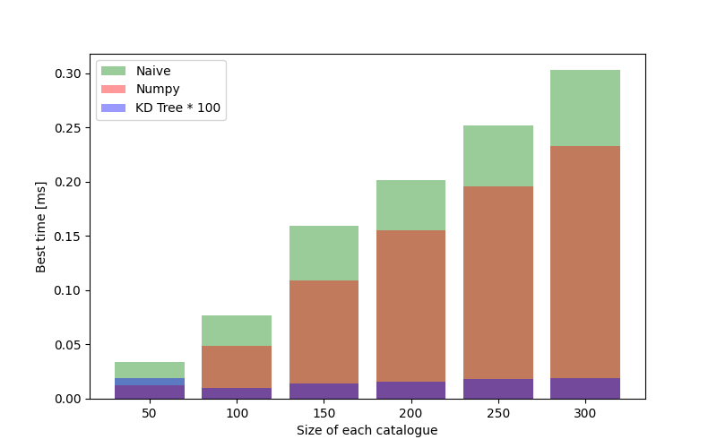
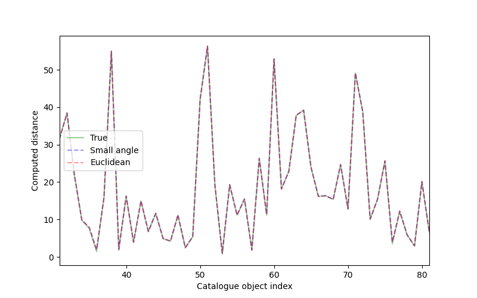

# Cross matcher

Astronomy relies on capturing image data from telescopes. Typically, several images of the sky are captured in different different parts of the Electromagnetic (EM) spectrum (corresponding to different *wavelenghts* of light). This approach is taken because different types of objects and phenomena are visible in different parts of the EM spectrum.

For example, Hydrogen (the most abundant element in the Universe) emits a characteristic peak of light with wavelength [21 cm](https://en.wikipedia.org/wiki/Hydrogen_line). These radio waves are excellent at penetrating cosmic dust which is opaque to visible light. Radio surveys therefore allow astronomers to probe objects deep in the Universe that they would otherwise be unable to see. Similarly, many interesting astrophysical objects such as [Quasars](https://en.wikipedia.org/wiki/Quasar) emit in the X-Ray region.

Cross matching is the process of matching objects catalogued from telescope images with data catalogued at different wavelengths of light. This repository implements explores the ideas behind cross matching objects between two astronomical survey image catalogues.

---

## Run code locally (tested on Mac)

* Set up virtual environment and install dependencies:

```bash
python3.10 -m venv venv
source venv/bin/activate
python -m pip install -r requirements
```

* Run the main script and the timing comparison script:

```bash
python main.py
[INFO] Script started successfully
[INFO] Loaded catalogue data
[INFO] Start cross matching
[INFO] Naive method found 151 matches and 9 objects with no match
[INFO] Naive method took 0.54046816698974 seconds
[INFO] Numpy method found 151 matches and 9 objects with no match
[INFO] Numpy method took 0.3870836670103017 seconds
[INFO] k-d tree method found 151 matches and 9 objects with no match
[INFO] k-d tree method took 0.0031861249881330878 seconds

python times.py
[INFO] Script started successfully
[INFO] Loaded catalogue data
[INFO] Starting timing comparison
[INFO] Plotting results
[INFO] Saving figure to ./figs/output.png
```

The results of the timing comparison script are shown in the figure below:



## Run linter and unit tests locally (tested on Mac)

* From the root directory:

```bash
$ black . [--diff]
...

$ python -m pytest -v
========================================================================================================== test session starts ==========================================================================================================
platform darwin -- Python 3.10.9, pytest-7.2.1, pluggy-1.0.0 -- /Users/elliotgoodwin/Elliot/Python/lo/venv/bin/python
cachedir: .pytest_cache
rootdir: <path>
collected 8 items                                                                                                                                                                                                                       

tests/test_cross_matcher.py::test_find_closest PASSED                                                                                                                                                                             [ 12%]
tests/test_cross_matcher.py::test_naive_crossmatch PASSED                                                                                                                                                                         [ 25%]
tests/test_cross_matcher.py::test_naive_vs_numpy_crossmatch PASSED                                                                                                                                                                [ 37%]
tests/test_kd_tree.py::test_numpy_vs_kd_tree_crossmatch PASSED                                                                                                                                                                    [ 50%]
tests/test_utils.py::test_ PASSED                                                                                                                                                                                                 [ 62%]
tests/test_utils.py::test_hms2dec PASSED                                                                                                                                                                                          [ 75%]
tests/test_utils.py::test_dms2dec PASSED                                                                                                                                                                                          [ 87%]
tests/test_utils.py::test_angular_dist PASSED                                                                                                                                                                                     [100%]

=========================================================================================================== 8 passed in 2.08s ===========================================================================================================
```

## Run code with Docker

* Run the following commands from the terminal (ensuring that the Docker daemon is launched):

```bash
docker build --pull --rm -f "Dockerfile" -t <image_name>:<tag> "."
docker run --rm -it <image_name>:<tag>

...

[INFO] Script started successfully
[INFO] Loaded catalogue data
[INFO] Start cross matching
[INFO] Naive method found 151 matches and 9 objects with no match
[INFO] Naive method took 0.5450518339930568 seconds
[INFO] Numpy method found 151 matches and 9 objects with no match
[INFO] Numpy method took 0.3759753750055097 seconds
[INFO] k-d tree method found 151 matches and 9 objects with no match
[INFO] k-d tree method took 0.0019470840052235872 seconds
```

---

## Background

### Why are you measuring angles in units of time?

If you're less interested in these details, feel free to skip ahead and take the functions in `src/utils.py` as a black box which calculates the angular distances in degrees/radians (which we'll be working with) from the input data in the catalogues.

---

Cartesian coordinates are not used here. This is because we want to match objects in the (3D) sky from their projection on a 2D plane (a telescope image). Therefore, we'll be considering the angular separation instead. Note that more sophisticated methods of crossmatching could certainly use other data such as distance in the dimension perpendicular to our image plane, redshifts, magnitude etc.

Angular separation is usually defined in terms of [Right ascension](https://en.wikipedia.org/wiki/Right_ascension) and [Declination](https://en.wikipedia.org/wiki/Declination) which are effectively a cosmic longitude/latitude. Right ascension and declination can be defined in terms of degrees/radians or, often the case in astronomical data, in terms the [Hour angle](https://en.wikipedia.org/wiki/Hour_angle) and [Minutes and second of arc](https://en.wikipedia.org/wiki/Minute_and_second_of_arc).

Right ascension and declination (in radians) can be used to calculate the angular separation radians between two points using the [Haversine formula](https://en.wikipedia.org/wiki/Haversine_formula).

### What is a cat and why is it super?

A cat is a catalogue of objects recorded in an astronomical survey.

* `super.csv`: contains an extract from the [SUPERCosmos all-sky catalogue](http://ssa.roe.ac.uk/allSky)
    * Surveyed in the visible light.
    * The first two columns are right ascension in degrees and declination in degrees, respectively.
* `bss.dat`: an extract of bright radio sources taken from the [AT20G BSS catalogue](http://cdsarc.u-strasbg.fr/cgi-bin/ftp-index?/ftp/cats/aliases/A/AT20G-BSS).
    * Radio astronomy survey.
    * 1: Object index (sometimes with an asterisk)
    * 2-4: Right ascension in HMS notation
    * 5-7: Declination in HMS notation
    * `>=8`: Other information (not relevant for this exercise)

### Cross matching implementation

1. Import catalogues
2. Convert right ascension (declination) from hms (dms) units to degrees/radians
3. Compute the angular distance (projection of sky on 2D plane) using [Haversine formula](https://en.wikipedia.org/wiki/Haversine_formula).
4. For each object in the `BSS` catalogue...
5. Find closest object by scanning through objects in the `SUPERCosmos` catalogue and finding object at minimum distance.
6. If there is an object within a given radius (related to the uncertainty of the measurement, telescope beam profile etc.) then object is a match.

The full `SUPERCosmos` catalogue contains over 126 million objects versus the 500 used here. Therefore, increasing the time taken to loop over each of the 160 `BSS` objects by 1 microsecond results in an overall execution time increase of `~126*10^6 * 160 * 1*10^-6 = 18,900` seconds, or about 5.25 hours. Clearly, this is a highly combinatorial problem where scalability is essential. In this repository, we'll look at a naive implementation, an attempt improve the algorithm by using more efficient data structures/computational techniques and finally, by improving the underlying algorithm.

The improved algorithm constructs a [k-d tree](https://en.wikipedia.org/wiki/K-d_tree) from both sets of catalogue data before querying the k-d trees to find the nearest neighbours. 

## Small angle approximation

One difference between the naive and `KDTree` algorithm is that the naive algorithm finds the nearest neighbour based on the great circle distance. In contrast, Scipy's `KDTree` class computes the genralised normalisation (length) of the distance between the N-dimensional coordinate vectors of two objects in an $L^p$ space, defined as

$$
|| x ||_p = \big(x_1^2 + x_2^2 + ... + x_N^2 \big) ^{\frac{1}{p}}
$$

By default (and in our implementation) the `KDTree` sets $p=2$. Consequently, the nearest neighbours for objects in the `KDTree` are found by computing the Euclidean distance between the objects.

The Haversine formula calculates the distance between the two points along a great circle of the sphere. It is given by

$$
d = 2 \mathrm{acrsin} \bigg( \sqrt{ \mathrm{sin}^2\frac{\phi_2 - \phi_1}{2} + \mathrm{cos}(\phi_1) \cdot \mathrm{cos}{\phi_2} \cdot \mathrm{sin}^2 \frac{\lambda_2 - \lambda_1}{2} } \bigg)
$$

where $\lambda$ is the delination and $\lambda$ is the right ascension, both in radians. For small angles, the following approximations hold true

$$
\mathrm{sin}(x) \approx x \\
\mathrm{cos}(x) \approx 1
$$

Applying the small angle approximation to the Haversine formula results in the usual Euclidean distance

$$
d = 2 \bigg( \sqrt{ \big( \frac{\phi_2 - \phi_1}{2} \big)^2 + \big( \frac{\lambda_2 - \lambda_1}{2} \big)^2  } \bigg) \\
= \sqrt{ \big( \phi_2 - \phi_1 \big)^2 + \big( \lambda_2 - \lambda_1 \big)^2  }  \\
$$

As far as I can tell, there is no option to use a custom metric (i.e. the metric for a curved space rather than a flat, Euclidean space) to Scipy's `KDTree` class. However, as long as we can validate that the small angle approximation holds true (typically in the regime where the angle $\theta \lesssim 10^\circ \approx 0.65 \mathrm{rad}$), then we can expect to use Scipy's implementation of `KDTree` without any issues. The physical interpretation of this is that angular separation is small enough that arclength of the angular separation and the straight-line distance between the two points is similar, meaning we can treat the right ascension and declination in degrees effectively as $(x, y)$ coordinates on a plane.

This assumption is tested in `small_angle.py`:

```bash
$ python small_angle.py
[INFO] Script started successfully
[INFO] Loaded catalogue data
[INFO] Summary of difference in distance between true value and small angle approx:

        idx      angular sep.            small angle             euclidean dist.         diff
        36       1.4127527387050025      1.9467886519998914      1.9467886519998914      -0.5340359132948889
        76       3.4911550455848004      3.9971829368629574      3.9971829368629574      -0.5060278912781571
        149      1.69344288245694        2.858837918324249       2.858837918324249       -1.1653950358673089

[INFO] Mean diff -0.044774329940070606
[INFO] Plotting comparison...
[INFO] Saving figure to ./figs/small_angle_approx.png
[INFO] Done
```

A sample of the difference between a small number of points in the `BSS` catalogue is shown in the figure below.



We see that, in general, the agreement between the true angular separation and seems pretty good. However, it's important to note that:

1. The output of the `small_angles.py` script (above) shows that there are are some points where the (rounded) difference between the true distance computed with the Haversine formula and the approximate distance computed with the Euclidean distance formula is non-zero.
2. This hasn't been explicitly confirmed by computing the distance between all the objects in the `BSS` and `SUPERCosmos` catalogues. As the `BSS` catalogue was a smaller survey, we might expect this to be local to a small neighbourhood. There's no guarantee that the `SUPERCosmos` catalogue (an all-sky survey) would be in the same neighbourhood.

In summary, it seems that we might be 'lucky' that this method worked so well out of the box with our dataset and this result shouldn't be assumed to hold for all datasets. However, it should be acknowledged that we are intentionally searching for nearest neighbours less than `max_dist` away from our object. If `max_dist` is small enough then we *guarantee* that we are only looking for nearest neighbours the regime where the small angle approximation holds.

To improve the algorithm and make sure it generalises to different data and different values of `max_dist`, we could either:

1. Query the `KDTree` with the distance calculation relevant to our scenario (i.e. swap out the Euclidean distance for the Haversine formula)
2. Determine the maximum value of `max_dist` where the small angle approximation holds.
    * If the input value for `max_dist` is above this value AND a nearest neighbour is matched to the object with an angular separation outside of the small angle approximation...
    * Then cross-verify the result by computing the true angular separation between the objects with the Haversine formula.
